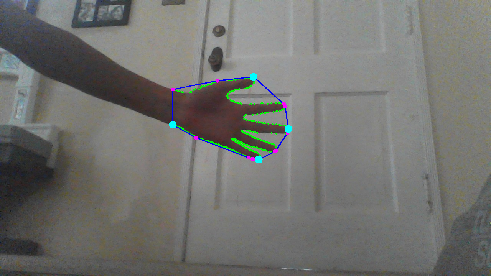
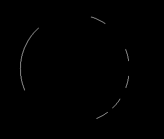

# Hand Gesture Recognition
Recognize hand gestures real time?

## Problems to solve to accomplish task
1. Segment hand region from background
2. Recognize the hand and figure positions into a single gesture

# Segmenting the Hand Region
## Background Subtraction
Use a running average to identify the background, which we will then use to isolate the foreground.

current frame (hand + background) - background = isolated foreground (just hand)

    
    
    

## Motion Detection and Thresholding
Take the absolute difference obtained above and threshold is so values above a certain threshold is 1 and below is 0.

    
    

## Contour Extraction
With the threshold, we extract the contour, which we assume to be the largest object. So if there is another object
larger than the hand then the contour of that object will now be the main focus.

    

# Counting the Fingers
## Convex Hull
After segmentation, a convex hull is created with the contour of the hand. This give us a polygon enclosing the hand.
We obtain the points of the convex hull that are most top, bottom, left, and right. Take the extreme points and
calculate the middle of the extreme points. This should be somewhat close to being the middle of the hand 
(a little above the center of the palm).

    
    

## Circle Mask
Take the center of the hand and create a circle with a radius that is equidistant to the furthest extreme point. This
circle will be used to mask the hand. Parts of the circle that overlaps the hand will be kept and white. The rest will
be black.

    
    

    
    

## Count

    

We get a number of different contours from the circular mask. The smaller contours are more likely to be fingers, so we
only count them.

And there you have it. Finger counting that only works when the background is still and the hand is the only object in
ROI, and if the hand is upright and not slanted towards the camera. We can definitely do better.